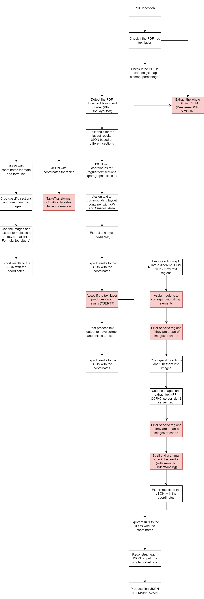

# Current Models and Tools

- **Layout** → PP-DocLayoutV3  
- **Text** → PyMuPDF  
- **Tables** → ?Table Transformer?, ??SLANet??, ???StructEqTable-Deploy???
- **Math** → PP-FormulaNet_plus-L
- **OCR** → PP-OCRv5_server_det, PP-OCRv5_server_rec
- **Post OCR Spell Correction** → Seq2Seq models, ?Gemma‑2?, ?Qwen3‑1.7B?, ??Llama??, ???Bert???
- **VLM** → ?PaddleOCR-VL-1.5?, ?olmOCR?

# Progress

- **Layout Detection** → 100%
- **Text Extraction** → 100%
- **Table Extraction** → 0%
- **Math** → 100%
- **OCR** → 100%
- **Post OCR Spell Correction** → 0%
- **VLM** → 20%
- **Post Process** → ??? %

# To-Do

- **Model Fireup Order**
- **Batch Calculation based on VRAM(if there is a gpu)**
- **?Multiproccessing?**

# Flowchart

